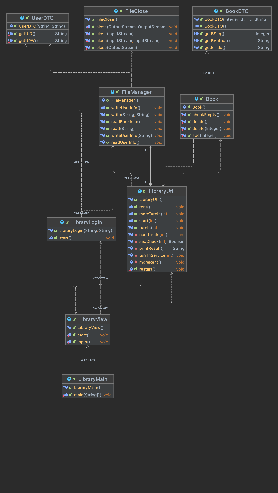

# proLibrary
**Java Project #1 - 도서 관리 프로그램 (Library Program)**  

## 1. Project Structure
- **프로그램 사용 목적 :** 사용자가 도서관에서 본인 계정으로 로그인하여 도서를 대여하고 반납할 수 있는 서비스  
- **기술스택 :** Java, IntelliJ IDEA Ultimate 2021.03 ver.  
- **JDK ver. :** openjdk-18 (Oracle OpenJDK Version 18)    

## 2. inMemory
Below are the packages used in this mini project.  
Furthermore, "inMemory" refers to data objects that are loaded in the memory section.  
This means that the data - loaded in RAM during the process - vanish as soon as the program shuts down.  

### [ Point Of View - Wide ]
*Total : 4 Packages + 9 Classes + 2 .txt files 

- proLibrary.preview : user에게 보여지는 화면을 띄워주는 패키지  
  - LibraryMain  
  - LibraryView  
- proLibrary.util : user가 사용할 수 있는 기능들을 모아둔 패키지  
  - LibraryLogin  
  - LibraryUtil  
- proLibrary.manage : user와 book에 대한 정보를 관리하는 패키지  
  - Book  
  - BookDTO  
  - UserDTO  
  - FileManager  
  - FileClose  
- proLibrary.libFiles : 도서관에 구비된 도서 목록, user 계정으로 대여한 도서 목록을 보관하는 패키지  
  - bookLibrary.txt  
  - info_userID.txt   

< 도서 관리 프로그램 > 을 Class Diagram 형태로 만들었을 때의 이미지입니다. 
- 구성 : 생성자, 메소드  
- Orientation : Bottom Up  

  

### [ Point Of View - Narrow ]
**1. 사용자 모드** 
  - 로그인(login)  
    : ID/PW 인증하여 로그인을 시도한다.
    
  - 대여(rent)  
    1. 도서관 책장에 책이 들어있어야하고, 도서관에 구비된 모든 도서 목록을 시각적으로 확인한다.
    2. 도서 목록을 확인한 후 어떤 도서를 대여 할건지 선택한다 (도서번호를 입력).
    3. 사용자의 대여 목록에 해당 도서가 들어간 것을 확인한 후 대여를 이어서 진행할지 선택한다.
    4. 이 때 y(yes) 선택 시 어떤 도서를 대여 할건지 입력한다.
    5. n(no) 선택 시 이전으로 돌아가서 대여/반납/종료 중 하나를 선택하게 된다.

  - 반납(turn in)  
    1. 사용자가 대여한 도서 목록이 뜨면 그 중 책 몇 권을 반납할건지 숫자를 입력한다.
    2. 어떤 책을 반납할건지 도서번호를 입력한다.
    3. 정말로 삭제할건지 입력한다. Y(yes) 선택 시 반납이 완료되면서 도서 목록에서 삭제된 것을 확인한다.
    4. n(no) 선택 시 반납이 취소된다.
    5. 이후에 더 반납할 도서가 있다면 더 반납하겠냐는 질문에 y(yes)를 눌러서 몇 권을, 어떤 책을 반납할건지 입력한다.
    6. 만약 더이상 반납할 도서가 없다면 이전 화면으로 돌아가서 대여/반납/종료 중 하나를 선택한다.

  - 종료  
    : 프로그램이 정상적으로 종료된다.  
    
**2. 관리자 모드** 
  - 파일 출력 (Read)  
    - bookList.txt  
      : 도서관에 구비된 전체 도서 목록을 .txt 파일 형태로 저장한다.
      
    - info_userID.txt  
      - 사용자가 책을 대여하기 전에 도서관에 구비된 도서 목록을 출력하여 화면에 띄워준다.
      - 사용자가 책을 대여한 후에 사용자의 대여 목록(list)에 어떤 도서들이 담겨있는지 출력한다.
      - 사용자가 책을 반납하기 전에 사용자의 대여 목록(list)에 어떤 도서들이 담겨있는지 출력한다.

  - 파일 입력 (Write)  
    - 사용자가 책을 대여할 때마다 사용자의 .txt 파일에 도서번호 순서(정렬)대로 도서번호, 저자, 제목을 추가하여 기록한다.  
    - 사용자가 책을 반납할 때마다 사용자의 .txt 파일을 갱신한다 (삭제된 도서를 제외한 나머지 도서 목록을 기록).    

## 3. External Files
1. bookList.txt : 도서관에 구비된 모든 도서 목록   
  

2. info_userID.txt : user 계정(jbyun)으로 대여한 도서 목록   
    

## 4. Source Code
1. Login 시 UserDTO class 생성자를 통해 uID(user ID), uPW (user Password) 값을 저장한다.   

  

2. 대여 및 반납 서비스 진행 시 사용자의 대여 list에 도서를 추가/삭제한다.   
  

3. FileManager class의 read(), write() 메소드를 활용하여 사용자의 도서 대여 목록, 도서관 전체 도서 목록을 화면에 뿌려주거나 변경사항을 기록/저장한다.   
  
    

## 5. Youtube
**Program Demonstration (시연 영상)** 
<iframe width="500" height="300" src="https://www.youtube.com/embed/VbCkOhijnjM" title="YouTube video player" frameborder="0" allow="accelerometer; autoplay; clipboard-write; encrypted-media; gyroscope; picture-in-picture" allowfullscreen></iframe>   

## 6. In Conclusion
- 클래스 상속, 접근제한자, Collection 등의 개념들을 직접 사용해보며 감각을 익힐 수 있어서 매우 의미있는 프로젝트였다.
- 프로그램 하나를 실행시키기 위해 만들어지는 클래스 개수가 생각보다 많아졌다. 처음에 계획했던 대로 흘러가지 않아서 개발 도중 머릿속으로 정리되지 않을 때도 있었지만, 반복적으로 class 흐름을 그려보고 접근제한자 범위를 다양하게 설정해보면서 극복할 수 있었다. 
- 아쉬운 점 1 : 인터페이스를 안써서 매번 DTO class를 불러와야하는 불편함이 있다. 다음부터는 인터페이스부터 먼저 구현해둔 다음 전체적인 틀을 만드는 방식으로 코드 작성을 해봐야할 것 같다. 
- 아쉬운 점 2 : 다음 프로젝트에서는 데이터베이스를 연동시켜서 거기에 데이터를 저장하고 불러오는 식으로 작업해보고싶다. 현재는 파일입출력 연습을 위해 .txt 파일에 모든 데이터 저장, 기록해두었지만 제대로 데이터베이스를 활용해서 완성도를 높이고싶다.
